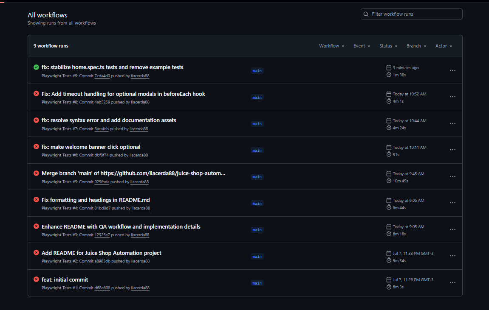
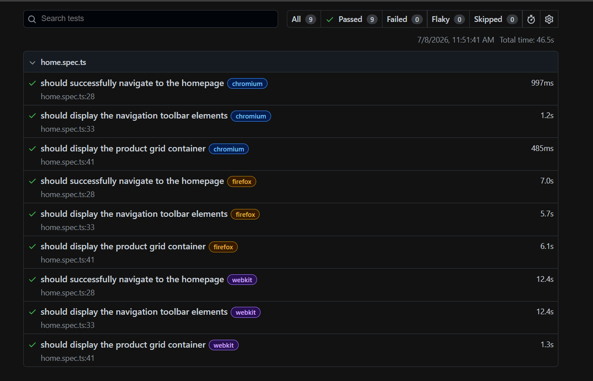
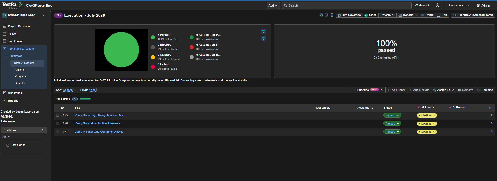
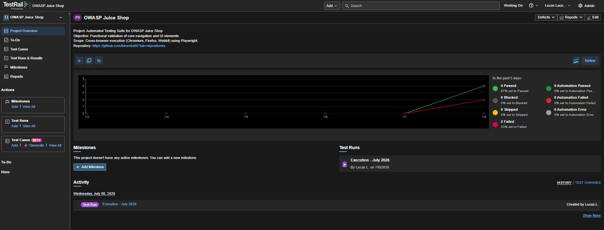

# Juice Shop Automation

Automated E2E test suite for OWASP Juice Shop using Playwright. This project demonstrates a professional QA workflow, from test design to continuous integration and test suite stabilization.

# QA Workflow
The following lifecycle ensures traceability and quality:

User Story -> Test Design (TestRail) -> Manual Execution -> Automation (Playwright) -> Git Commit -> Push -> GitHub Actions (CI) -> Result Reporting (TestRail)

# Technical Implementation Journey
This project was developed and refined through the following systematic steps:

1. **Project Workspace Setup**: Environment preparation.
2. **IDE Integration**: VS Code configuration.
3. **Framework Initialization**: Playwright setup.
4. **Sanity Test Execution**: Initial smoke testing.
5. **Test Report & Artifacts Generation**: HTML reporting and logs.
6. **Configuration File Inspection**: Reviewing `playwright.config.ts`.
7. **Target Environment Parameterization**: Base URL configuration.
8. **Test Specification File Creation**: Writing test scripts.
9. **Core Module Importation**: Dependency management.
10. **IDE Test Runner Integration**: Debugging via UI.
11. **Page Navigation Command**: Scripting browser actions.
12. **Page Title Assertion**: Validation of expected states.
13. **Test Execution via IDE**: Final validation.
14. **Test Stabilization & Optimization**: Refactoring of test scripts to include dynamic locators (`locator.first()`), exception handling for asynchronous UI elements (`try/catch`), and removal of unmaintained dependency files to eliminate flakiness.
15. **Continuous Integration & Documentation**: Implementation of automated CI pipelines via GitHub Actions and formal synchronization of execution results with TestRail to ensure auditability.

# Tech Stack
- **Testing**: Playwright, TypeScript
- **Management**: TestRail
- **CI/CD**: GitHub Actions
- **Version Control**: Git

# Evidence & Reporting
Documented project health and execution history:

- **CI/CD Pipeline Status**: 
- **Playwright Execution Report**: 
- **TestRail Execution Results**: 
- **Project Progress Overview**: 
